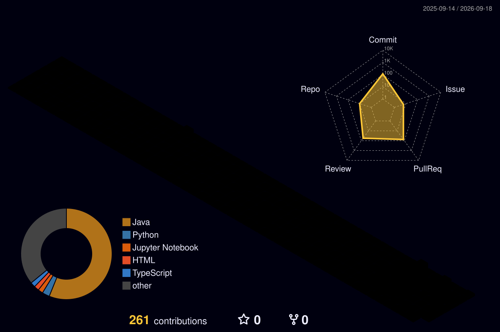

 

 <em style="font-size: 2em;"> 새는 알에서 나오려고 투쟁한다.  알은 세계이다.  태어나려고 하는 자는 누구든 하나의 세계를 파괴하여야 한다. </em> 

 

## Skills

<!--
**horisomebody/horisomebody** is a ✨ _special_ ✨ repository because its `README.md` (this file) appears on your GitHub profile.

Here are some ideas to get you started:

- 🔭 I’m currently working on ...
- 🌱 I’m currently learning ...
- 👯 I’m looking to collaborate on ...
- 🤔 I’m looking for help with ...
- 💬 Ask me about ...
- 📫 How to reach me: ...
- 😄 Pronouns: ...
- ⚡ Fun fact: ...
-->

